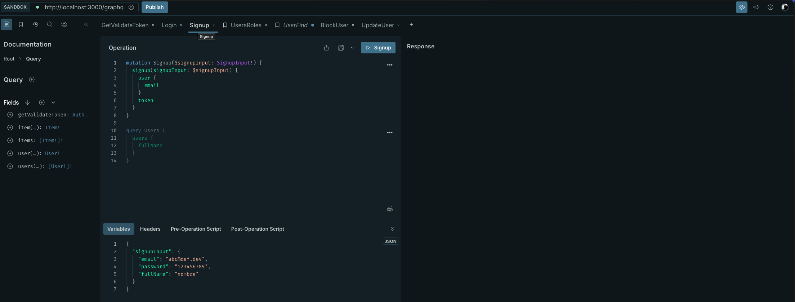
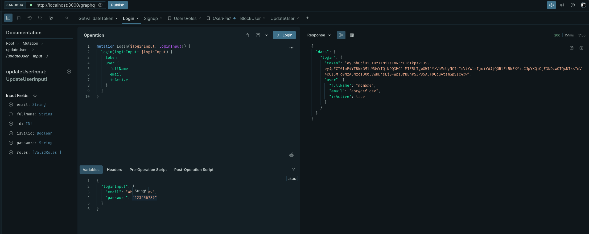
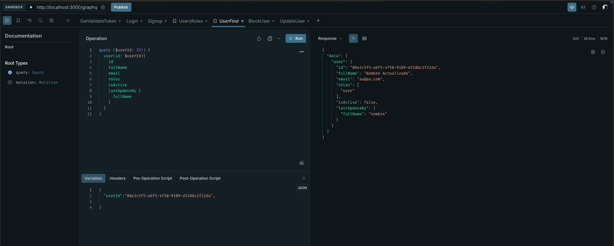
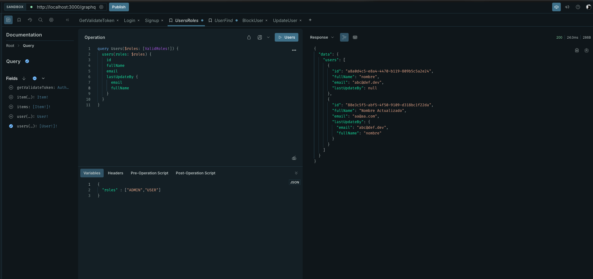
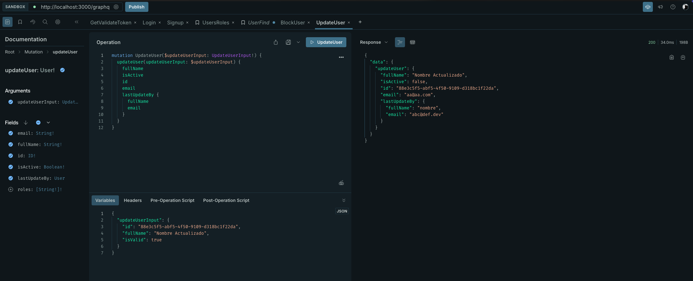

<p align="center">
  <a href="http://nestjs.com/" target="blank"></a>
</p>


# Clonar proyecto
```bash
git clone https://github.com/favillon/...........
```

# Crear el .env y modifica los valores
```bash
cp .env.template .env
```

# Run the app
Para correr la aplicación en modo desarrollo ejecuta el siguiente comando:
```bash
yarn run start:dev
```
# Levantar DB

```bash
docker-compose up -d
```


# Validacion de loas Query y Mutaciones

```
localhost:3000/graphql
```

> Consumos de las Query y Mutaciones

## Signup


## Login


## User Find


## Roles


## Update User



## Ejecucion con  build

> docker-compose -f docker-compose.prod.yml --env-file .env.prod up --build

## Solo Ejecucion

> docker-compose -f docker-compose.prod.yml --env-file .env.prod up